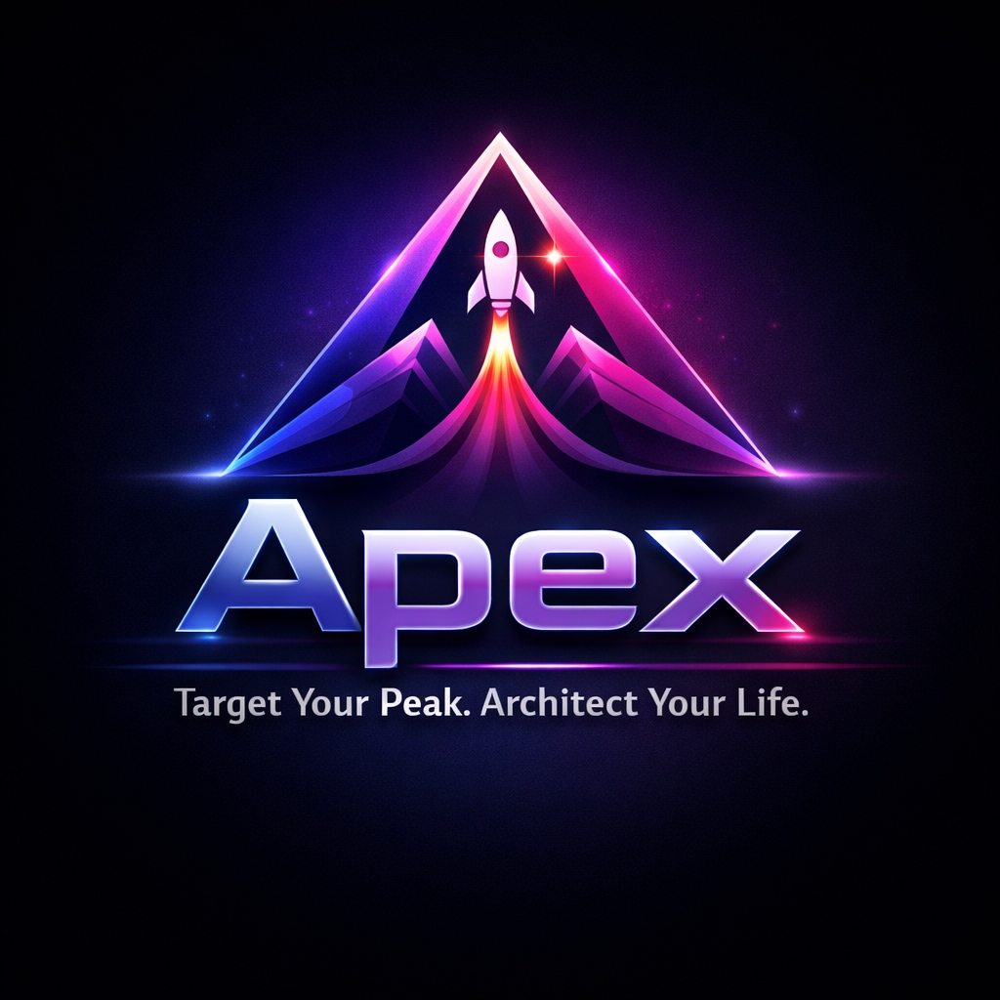

# Apex 🚀

**Target Your Peak. Architect Your Life.**

Apex is a premium, gamified personal growth dashboard designed to help you master your habits, finances, and clarity of mind. It combines rigorous tracking with AI-powered coaching to keep you aligned with your "North Star" goal.



## 🌟 Key Features

### 1. **Gamified Habit Engine**
- **XP & Leveling System**: Earn XP for every habit completed. Level up as you build consistency.
- **Streaks**: Visual fire streaks to maintain momentum.
- **Squad Leaderboards**: Compete with others (or your past self) on the global leaderboard.

### 2. **AI Coach & Planner** (Powered by Gemini 2.5)
- **Context-Aware Coaching**: The AI Coach knows your profile, goals, and recent activity.
- **Adaptive Personalities**: Choose your coach's vibe:
  - 🧘 **Zen Master**: Calm, encouraging, peaceful.
  - 🥋 **Drill Sergeant**: Tough love, demanding, no excuses.
  - 🔬 **Data Scientist**: Analytical, logical, strategic.
- **AI Planner**: Generate actionable daily habits based on your main goal instantly.

### 3. **Life Management Modules**
- **🏠 Today Dashboard**: Central hub for daily habits, sleep tracking, and quick logs.
- **📅 Monthly Progress**: Calendar view and pattern analysis of your consistency.
- **💰 Finance Tracker**: Set financial goals and track deposits towards them.
- **😴 Immersive Sleep Mode**: Distraction-free interface to track sleep duration.

### 4. **Modern, Premium Design**
- **Aesthetic**: Deep dark mode with indigo/fuchsia ambient glows (Glassmorphism).
- **Responsive**: Fully functional on desktop and mobile web.
- **Animations**: Fluid transitions and micro-interactions.

---

## 🛠️ Tech Stack

- **Frontend**: React 19, Vite, Tailwind CSS
- **Backend Services**: Firebase (Authentication, Firestore Database)
- **AI**: Google Gemini API (`gemini-2.5-flash`)
- **Icons**: Lucide React

---

## 🚀 Getting Started

### Prerequisites

1.  **Node.js** installed.
2.  **Firebase Project** with Auth (Email/Anonymous) and Firestore enabled.
3.  **Gemini API Key** (Get one from [Google AI Studio](https://aistudio.google.com/)).

### Installation

1.  **Clone the repository**:
    ```bash
    git clone <repo-url>
    cd Frontend
    ```

2.  **Install dependencies**:
    ```bash
    npm install
    ```

3.  **Configure Environment**:
    Create a `.env.local` file in the `Frontend` directory:
    ```env
    VITE_FIREBASE_API_KEY=your_api_key
    VITE_FIREBASE_AUTH_DOMAIN=your_project.firebaseapp.com
    VITE_FIREBASE_PROJECT_ID=your_project_id
    VITE_FIREBASE_STORAGE_BUCKET=your_bucket
    VITE_FIREBASE_MESSAGING_SENDER_ID=your_sender_id
    VITE_FIREBASE_APP_ID=your_app_id
    
    # AI Configuration
    VITE_GEMINI_KEY=your_gemini_api_key
    VITE_GEMINI_USE_PROXY=false
    ```

4.  **Run Locally**:
    ```bash
    npm run dev
    ```

---

## 📂 Project Structure

- **`src/App.jsx`**: Main application shell and routing logic. contains all major screens (`HomeScreen`, `AICoachScreen`, etc.) for simplicity in this version.
  - *Refactoring Note*: In a larger app, screens should be split into `src/screens/`.
- **`src/firebase.js`**: Firebase initialization and exports (`auth`, `db`).
- **`public/`**: Static assets like the logo (`apex-logo.svg`).

---

## 🔐 Auth & Privacy

- Supports **Anonymous Login** for instant access.
- **Upgrade Path**: Convert anonymous accounts to permanent Email/Password accounts without losing data.
- **Data Privacy**: All user data is stored in Firestore under strict user-ID based paths (`artifacts/public/data/profiles` for leaderboards).

---

## 📦 Deployment

Ready for **Firebase Hosting**.
See `DEPLOYMENT.md` for a step-by-step guide.
